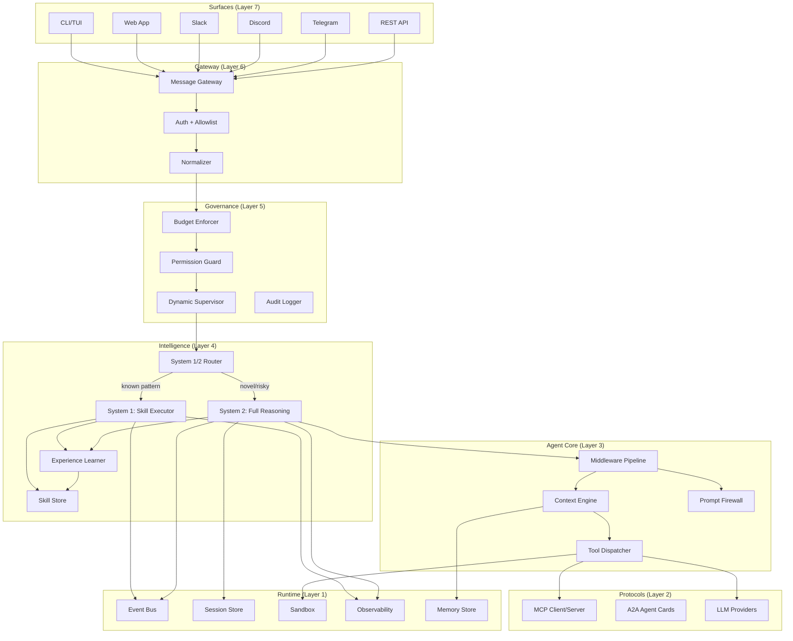

# Project NEXUS — The Agent That Gets Smarter & Cheaper Over Time

> Blueprint for a market-dominating AI agent platform, synthesized from analyzing 9 leading open-source projects + cutting-edge research.

---

## The Core Thesis

Every existing agent has the same fundamental economics problem:

```
Task #1:    costs $0.15,  takes 3 minutes
Task #100:  costs $0.15,  takes 3 minutes   ← SAME COST
Task #1000: costs $0.15,  takes 3 minutes   ← STILL THE SAME
```

**Nexus flips this:**

```
Task #1:    costs $0.15,  takes 3 minutes   (System 2: full reasoning)
Task #100:  costs $0.04,  takes 45 seconds  (System 1: skill match + fast path)
Task #1000: costs $0.01,  takes 10 seconds  (System 1: internalized, near-instant)
```

**The more you use Nexus, the cheaper and faster it gets.** This is the moat no existing project has.

---

## Why This Wins

### What we're taking from each project:

| Source | What We're Taking | Why It's Best-in-Class |
|--------|------------------|----------------------|
| **Hermes** | Self-improving skill system + multi-platform gateway | Only project with learning loop |
| **Deep Agents** | Middleware-first composable architecture | Cleanest composition model |
| **Open SWE** | Deterministic safety nets (after-agent middleware) | Elegant failure prevention |
| **Goose** | Multi-inspector security pipeline + MCP | Most secure + most interoperable |
| **Paperclip** | Budget enforcement + organizational governance | Only project with real cost control |
| **OpenClaw** | Multi-channel gateway + plugin architecture | Best platform reach |
| **MiroFish** | Graph memory integration | Best knowledge persistence |
| **Career-Ops** | Mode system (zero-code domain specialization) | Most accessible to non-developers |
| **Claw Code** | Policy engine + green contracts + recovery recipes | Most formal safety model |

### What we're adding that NO project has:

| Innovation | Source | Why It's a Moat |
|-----------|--------|----------------|
| **System 1/2 Dual-Process Routing** | Cognitive science research | 60-80% cost reduction on routine tasks |
| **Experience Learning (Reflect + Evolve)** | ERL / Memento-Skills research | Agent actually improves over time |
| **A2A Agent Cards** | A2A v1.0 (Linux Foundation) | First to market with agent interop |
| **Dynamic Supervision (HOTL)** | HITL→HOTL paradigm | Right oversight without bottlenecks |
| **Observability as Infrastructure** | Industry consensus (2026) | Production-grade from day 1 |
| **Context Engineering Pipeline** | Context engineering research | Minimal context waste, maximum relevance |
| **Prompt Firewall + Behavioral Monitoring** | OpenAgentSafety (ICLR 2026) | Enterprise-grade security |
| **Event-Driven Architecture** | EDA research | Scalable, debuggable, extensible |

---

## Architecture

### The 7-Layer Stack

```
┌──────────────────────────────────────────────────────────────┐
│  Layer 7: SURFACES                                           │
│  CLI · Web · Slack · Discord · Telegram · WhatsApp · API     │
├──────────────────────────────────────────────────────────────┤
│  Layer 6: GATEWAY                                            │
│  Message normalization · Auth · Rate limiting · Routing      │
├──────────────────────────────────────────────────────────────┤
│  Layer 5: GOVERNANCE                                         │
│  Budgets · Permissions · Dynamic Supervision · Audit trail   │
├──────────────────────────────────────────────────────────────┤
│  Layer 4: INTELLIGENCE                                       │
│  System 1/2 Router · Skill Store · Experience Learner        │
├──────────────────────────────────────────────────────────────┤
│  Layer 3: AGENT CORE                                         │
│  Middleware pipeline · Tool dispatch · Context engineering    │
├──────────────────────────────────────────────────────────────┤
│  Layer 2: PROTOCOLS                                          │
│  MCP (tools) · A2A (agent interop) · Provider API (LLMs)    │
├──────────────────────────────────────────────────────────────┤
│  Layer 1: RUNTIME                                            │
│  Event bus · Session store · Sandbox · Observability         │
└──────────────────────────────────────────────────────────────┘
```

### Detailed Architecture Diagram



---

## Technology Stack

### Why TypeScript (not Rust, not Python)

| Consideration | Python | Rust | TypeScript | Winner |
|--------------|--------|------|-----------|--------|
| **LLM SDK ecosystem** | Best (LangChain, LlamaIndex) | Good (but smaller) | Good (Vercel AI SDK, LangChainJS) | Python |
| **Web/API development** | OK (FastAPI) | Hard (Axum) | Best (Next.js, Express, Hono) | TypeScript |
| **Multi-platform deployment** | Poor | Complex | Best (Node, Bun, Deno, Edge, Mobile) | TypeScript |
| **Plugin ecosystem** | pip | cargo | npm (largest) | TypeScript |
| **Hackability (community contributions)** | Good | Poor (steep learning curve) | Best | TypeScript |
| **Type safety** | Poor | Best | Good (strict mode) | Rust |
| **Performance** | Worst | Best | Good (V8 is fast enough) | Rust |
| **Real-time/WebSocket** | OK | Good | Best (native) | TypeScript |

**Decision: TypeScript with Bun runtime**
- Bun gives us near-Rust performance for I/O-heavy workloads
- TypeScript's type system is expressive enough for our middleware pattern
- npm ecosystem = largest plugin marketplace potential
- Easiest for community contributions (OpenClaw proved this with 300+ contributors)
- Hono for the HTTP layer (lightweight, fast, runs everywhere)

### Core Dependencies

```json
{
  "runtime": "bun@1.2+",
  "framework": "hono",
  "database": "drizzle-orm + PostgreSQL",
  "cache": "redis (via upstash for serverless)",
  "vector_db": "pgvector (in PostgreSQL)",
  "event_bus": "bullmq (Redis-backed queues)",
  "observability": "opentelemetry",
  "llm_sdk": "@ai-sdk/core (Vercel AI SDK)",
  "mcp": "@anthropic/mcp-sdk",
  "testing": "vitest + playwright",
  "tui": "ink (React for CLIs)"
}
```

---

## The Five Killer Features

### Feature 1: System 1/2 Dual-Process Routing

```typescript
class DualProcessRouter {
  async route(task: NormalizedTask): Promise<ExecutionPath> {
    // 1. Check skill store for high-confidence match
    const skillMatch = await this.skillStore.find(task, threshold: 0.90);
    
    // 2. Assess risk
    const risk = await this.riskModel.score(task);
    
    // 3. Route decision
    if (skillMatch && skillMatch.confidence > 0.90 && risk < 0.3) {
      // SYSTEM 1: Fast path — execute skill directly
      // No full LLM reasoning loop, just template + fill
      return {
        path: "system1",
        skill: skillMatch,
        estimatedCost: skillMatch.avgCost * 0.1,  // 90% cheaper
        estimatedTime: skillMatch.avgTime * 0.2,   // 80% faster
      };
    }
    
    if (risk > 0.7) {
      // SYSTEM 2 + HITL: Slow path with human checkpoint
      return { path: "system2_supervised", requiresApproval: true };
    }
    
    // SYSTEM 2: Full reasoning loop
    return { path: "system2", estimatedCost: this.estimateCost(task) };
  }
}
```

**User-facing impact**: "Nexus just handled that in 2 seconds for $0.002" vs. competitors spending $0.15 and 3 minutes on the exact same task.

### Feature 2: Experience Learning Loop

```typescript
class ExperienceLearner {
  // Stage 1: STORE — Save what happened
  async storeTrajectory(session: Session) {
    await this.trajectoryStore.save({
      task: session.task,
      actions: session.toolCalls,
      outcome: session.outcome,
      cost: session.totalCost,
      duration: session.duration,
    });
  }
  
  // Stage 2: REFLECT — What went well/wrong?
  async reflect(trajectory: Trajectory) {
    const reflection = await this.llm.generate({
      system: "You are a performance analyst reviewing an agent's work.",
      prompt: `Analyze this execution:
        Task: ${trajectory.task}
        Actions: ${JSON.stringify(trajectory.actions)}
        Outcome: ${trajectory.outcome}
        
        Provide:
        1. Success factors (what to repeat)
        2. Failure points (what to avoid)
        3. Efficiency opportunities (what to skip next time)
        4. Skill extraction (reusable pattern?)`,
    });
    return reflection;
  }
  
  // Stage 3: EVOLVE — Create/improve skills
  async evolve(trajectory: Trajectory, reflection: Reflection) {
    if (reflection.hasSkillPattern) {
      const existingSkill = await this.skillStore.findSimilar(reflection.pattern);
      
      if (existingSkill) {
        // Mutate existing skill with new learnings
        const mutated = await this.mutateSkill(existingSkill, reflection);
        const testResult = await this.validateSkill(mutated);
        if (testResult.passed) {
          await this.skillStore.update(existingSkill.id, mutated);
        }
      } else {
        // Create new skill
        const newSkill = await this.createSkill(reflection);
        await this.skillStore.add(newSkill);
      }
    }
  }
}
```

### Feature 3: Middleware Pipeline (Composable)

```typescript
// Inspired by Deep Agents' middleware stack + Open SWE's safety nets

const agent = createNexusAgent({
  model: "anthropic:claude-sonnet-4-20250514",
  
  // Middleware executes in order (like Express/Koa)
  middleware: [
    // Before agent thinks
    promptFirewall(),                        // Block injection attempts
    contextPipeline({ lazy: true }),         // Load context on-demand
    budgetEnforcer({ scope: "task" }),        // Check budget before each call
    
    // Around agent execution
    dynamicSupervisor({ defaultMode: "hotl" }), // Risk-based oversight
    observability({ tracing: true }),            // Full execution traces
    
    // After agent finishes
    safetyNet("commit_changes"),             // Deterministic cleanup (Open SWE pattern)
    experienceLearner(),                     // Learn from this session
    skillExtractor(),                        // Extract reusable patterns
  ],
  
  // Tools available
  tools: [
    ...mcpTools("filesystem"),               // MCP-based tools
    ...mcpTools("terminal"),
    ...mcpTools("web"),
    ...customTools(myPlugins),
  ],
  
  // Skills (procedural memory)
  skills: await skillStore.loadActive(),
  
  // Memory (semantic + episodic)
  memory: {
    semantic: pgVectorMemory({ table: "facts" }),
    episodic: pgVectorMemory({ table: "episodes" }),
  },
});
```

### Feature 4: Multi-Surface Gateway

```typescript
// Inspired by OpenClaw's gateway + Hermes' multi-platform

const gateway = createGateway({
  surfaces: {
    cli: cliSurface({ tui: "ink" }),
    web: webSurface({ port: 3000 }),
    slack: slackSurface({ token: env.SLACK_TOKEN }),
    discord: discordSurface({ token: env.DISCORD_TOKEN }),
    telegram: telegramSurface({ token: env.TELEGRAM_TOKEN }),
    api: apiSurface({ port: 8080, auth: "bearer" }),
    webhook: webhookSurface({ 
      sources: ["github", "linear", "jira"] // Open SWE pattern
    }),
  },
  
  // All surfaces normalize to the same message format
  // Route to the same agent core
  agent: nexusAgent,
  
  // Per-surface configuration (OpenClaw pattern)
  surfaceConfig: {
    slack: { mentionGating: true, typingIndicators: true },
    telegram: { markdownMode: "v2" },
    cli: { richFormatting: true, spinners: true },
  },
});
```

### Feature 5: Mode System (Zero-Code Domain Specialization)

```typescript
// Inspired by Career-Ops' mode files — anyone can create a domain agent

// modes/code-reviewer.md
const codeReviewerMode = `
# Code Reviewer Mode

## Trigger
When user asks to review code, a PR, or a diff.

## Procedure
1. Read the changed files
2. For each file, analyze:
   - Correctness (bugs, logic errors)
   - Security (injection, auth issues, secrets)
   - Performance (N+1 queries, unnecessary allocations)
   - Style (naming, structure, consistency)
3. Produce a structured review

## Output Format
| File | Line | Severity | Issue | Suggestion |
|------|------|----------|-------|------------|

## Constraints
- Never auto-fix without asking
- Flag but don't block style-only issues
- Always check for test coverage
`;

// Users create modes as markdown files — no code needed
// Drop a .md file in modes/ and Nexus learns a new specialty
```

---

## Project Structure

```
nexus/
├── packages/
│   ├── core/                    # Agent core (Layer 3)
│   │   ├── src/
│   │   │   ├── agent.ts         # Main agent loop
│   │   │   ├── middleware.ts    # Middleware pipeline
│   │   │   ├── context.ts      # Context engineering pipeline
│   │   │   ├── tools.ts        # Tool dispatcher
│   │   │   └── types.ts        # Core type definitions
│   │   └── package.json
│   │
│   ├── intelligence/            # Intelligence layer (Layer 4)
│   │   ├── src/
│   │   │   ├── router.ts       # System 1/2 dual-process router
│   │   │   ├── skills.ts       # Skill store + mutation
│   │   │   ├── learner.ts      # Experience learning loop
│   │   │   ├── memory.ts       # Semantic + Episodic memory
│   │   │   └── reflection.ts   # Post-task reflection engine
│   │   └── package.json
│   │
│   ├── governance/              # Governance layer (Layer 5)
│   │   ├── src/
│   │   │   ├── budget.ts       # Multi-scope budget enforcement
│   │   │   ├── permissions.ts  # Permission guard
│   │   │   ├── supervisor.ts   # Dynamic HOTL supervisor
│   │   │   ├── firewall.ts     # Prompt firewall + output scanning
│   │   │   └── audit.ts        # Immutable audit logger
│   │   └── package.json
│   │
│   ├── gateway/                 # Gateway layer (Layer 6)
│   │   ├── src/
│   │   │   ├── gateway.ts      # Message gateway + routing
│   │   │   ├── normalizer.ts   # Cross-surface message normalization
│   │   │   └── surfaces/       # Platform-specific adapters
│   │   │       ├── cli.ts
│   │   │       ├── web.ts
│   │   │       ├── slack.ts
│   │   │       ├── discord.ts
│   │   │       ├── telegram.ts
│   │   │       └── webhook.ts
│   │   └── package.json
│   │
│   ├── protocols/               # Protocol layer (Layer 2)
│   │   ├── src/
│   │   │   ├── mcp-client.ts   # MCP tool access
│   │   │   ├── mcp-server.ts   # Expose Nexus as MCP server
│   │   │   ├── a2a.ts          # A2A Agent Cards + task delegation
│   │   │   └── providers.ts    # LLM provider abstraction
│   │   └── package.json
│   │
│   ├── runtime/                 # Runtime layer (Layer 1)
│   │   ├── src/
│   │   │   ├── event-bus.ts    # BullMQ event-driven backbone
│   │   │   ├── sessions.ts     # Session store (PostgreSQL)
│   │   │   ├── sandbox.ts      # Execution sandboxing
│   │   │   ├── observability.ts # OpenTelemetry tracing
│   │   │   └── db.ts           # Drizzle ORM + migrations
│   │   └── package.json
│   │
│   └── db/                      # Database schema
│       ├── src/
│       │   ├── schema.ts       # Drizzle schema definitions
│       │   └── migrations/     # SQL migrations
│       └── package.json
│
├── apps/
│   ├── cli/                     # CLI application (Surface)
│   │   ├── src/
│   │   │   ├── index.ts        # Entry point
│   │   │   ├── tui.tsx         # Ink-based TUI
│   │   │   └── commands/       # CLI commands
│   │   └── package.json
│   │
│   ├── web/                     # Web dashboard (Surface)
│   │   ├── src/
│   │   │   ├── app/            # Next.js App Router
│   │   │   └── components/     # React components
│   │   └── package.json
│   │
│   └── server/                  # API server
│       ├── src/
│       │   ├── index.ts        # Hono server
│       │   └── routes/         # API routes
│       └── package.json
│
├── modes/                       # Zero-code domain modes
│   ├── _shared.md              # Shared primitives
│   ├── coding.md               # Software engineering mode
│   ├── research.md             # Research & analysis mode
│   ├── code-review.md          # Code review mode
│   ├── devops.md               # DevOps & deployment mode
│   └── writing.md              # Technical writing mode
│
├── skills/                      # Auto-generated skill library
│   └── (auto-populated by Experience Learner)
│
├── docker-compose.yml           # PostgreSQL + Redis
├── AGENTS.md                    # AI agent context for Nexus itself
├── package.json                 # Monorepo root (workspaces)
└── turbo.json                   # Turborepo config
```

---

## Implementation Phases

### Phase 1: Foundation (Weeks 1-3) — Core Agent Loop

**Goal**: A working CLI agent that can do what Hermes/Goose do — converse, use tools, persist sessions.

```
Deliverables:
├── packages/core         — Agent loop + middleware pipeline + tool dispatch
├── packages/runtime      — Session store + event bus + observability stubs
├── packages/protocols    — LLM provider abstraction (Anthropic + OpenAI)
├── packages/db           — PostgreSQL schema + Drizzle ORM
├── apps/cli              — Basic CLI with Ink TUI
└── docker-compose.yml    — PostgreSQL + Redis
```

**Key decisions in Phase 1**:
- Middleware pipeline modeled after Koa.js (context flows through middleware chain)
- Sessions persisted in PostgreSQL (not file-based like Goose/Hermes)
- OpenTelemetry spans from day 1 (even if just logging initially)
- Tool schemas validated via Zod (typed contracts pattern from our research)

### Phase 2: Intelligence (Weeks 4-6) — The Differentiator

**Goal**: System 1/2 routing + skills + experience learning. This is where we pull ahead.

```
Deliverables:
├── packages/intelligence — System 1/2 router + skill store + experience learner
├── packages/core         — Context engineering pipeline (lazy loading)
├── modes/                — First 3 domain modes (coding, research, code-review)
└── skills/               — Seed skills (from analyzing Hermes' skill patterns)
```

**Key decisions in Phase 2**:
- Skills stored as markdown + YAML metadata (Career-Ops pattern)
- Skills indexed in pgvector for semantic search
- Reflection runs as a background job (no user-facing latency)
- System 1 fast path uses template prompts, not full agent loop

### Phase 3: Safety & Governance (Weeks 7-8)

**Goal**: Production-grade security that enterprises trust.

```
Deliverables:
├── packages/governance   — Budget enforcer + permissions + dynamic supervisor
├── packages/core         — Prompt firewall middleware + output scanning
├── packages/runtime      — Sandbox integration (Docker-based)
└── Agent behavioral monitoring (anomaly detection)
```

**Key decisions in Phase 3**:
- Multi-scope budgets (user/project/task) like Paperclip
- Dynamic supervision (HOTL by default, HITL for high-risk)
- Green contracts (Claw Code pattern) for auto-approved safe operations
- Prompt firewall as first middleware (always runs first)

### Phase 4: Multi-Surface Gateway (Weeks 9-11)

**Goal**: Reach users everywhere — CLI, web, Slack, Discord, Telegram, webhooks.

```
Deliverables:
├── packages/gateway      — Gateway + normalizer + all surface adapters
├── apps/web              — Web dashboard with session viewer + skill browser
├── apps/server           — Hono API server
└── Surface-specific features (typing indicators, reactions, thread support)
```

**Key decisions in Phase 4**:
- Single WebSocket gateway like OpenClaw (all surfaces connect here)
- Deterministic session IDs from source (Open SWE pattern)
- Per-surface config overrides (OpenClaw pattern)
- Webhook → event bus → agent (event-driven, not synchronous)

### Phase 5: Protocol & Interop (Weeks 12-14)

**Goal**: MCP + A2A support. Nexus can use any MCP tool and be discoverable by other agents.

```
Deliverables:
├── packages/protocols    — MCP client/server + A2A Agent Cards
├── Plugin system          — npm-based plugin loading
└── Agent Card publisher   — Nexus publishes its own Agent Card
```

### Phase 6: Polish & Launch (Weeks 15-16)

```
Deliverables:
├── Documentation site
├── Quick-start templates
├── Mode marketplace (community modes)
├── Skill sharing (opt-in federated skills)
├── Landing page + demo video
└── npm publish + GitHub release
```

---

## Competitive Positioning

### Where Nexus Sits

```
                    Simple ───────────────────── Complex
                    │                                  │
             ┌──────┤                                  │
   Personal  │ Career-Ops                              │
   agent     │      Hermes                    OpenClaw │
             │         Goose                           │
             └──────┤                                  │
                    │                                  │
             ┌──────┤                                  │
   Developer │ Claw Code                               │
   agent     │    Deep Agents                          │
             │       Open SWE                          │
             └──────┤                                  │
                    │                                  │
             ┌──────┤                                  │
   Platform  │      │              ★ NEXUS ★           │
             │      │        (learns + multi-surface   │
             │      │         + governed + cheap)       │
             │      │                         Paperclip│
             └──────┤                                  │
                    │                                  │
                    Cheap ──────────────────── Expensive
```

### The Three-Sentence Pitch

> **Nexus is an AI agent that gets smarter and cheaper the more you use it.** It learns from every task, builds reusable skills, and routes routine work through a fast path that's 10x cheaper than competitors. It works everywhere — CLI, web, Slack, Discord, Telegram — with enterprise-grade security, budgets, and observability built in.

### Differentiation Matrix

| Feature | Hermes | Goose | OpenClaw | Paperclip | **Nexus** |
|---------|:------:|:-----:|:--------:|:---------:|:---------:|
| Self-improving skills | ✅ | ❌ | ⚠️ | ❌ | ✅ |
| Skill mutation on failure | ❌ | ❌ | ❌ | ❌ | ✅ |
| System 1/2 cost optimization | ❌ | ❌ | ❌ | ❌ | ✅ |
| Experience learning (reflect) | ❌ | ❌ | ❌ | ❌ | ✅ |
| MCP interoperability | ✅ | ✅ | ❌ | ❌ | ✅ |
| A2A Agent Cards | ❌ | ❌ | ❌ | ❌ | ✅ |
| Multi-platform gateway | ✅ | ❌ | ✅ | ❌ | ✅ |
| Budget enforcement | ❌ | ❌ | ❌ | ✅ | ✅ |
| Dynamic supervision (HOTL) | ❌ | ⚠️ | ❌ | ❌ | ✅ |
| Prompt firewall | ❌ | ❌ | ⚠️ | ❌ | ✅ |
| Observability (OpenTelemetry) | ❌ | ❌ | ❌ | ❌ | ✅ |
| Zero-code modes | ❌ | ❌ | ❌ | ❌ | ✅ |
| Event-driven architecture | ❌ | ❌ | ❌ | ❌ | ✅ |
| Middleware composition | ❌ | ❌ | ❌ | ❌ | ✅ |

---

## Database Schema (Core Tables)

```sql
-- Sessions
CREATE TABLE sessions (
  id UUID PRIMARY KEY DEFAULT gen_random_uuid(),
  user_id UUID REFERENCES users(id),
  surface TEXT NOT NULL,  -- 'cli', 'slack', 'discord', etc.
  source_thread_id TEXT,  -- Platform-specific thread ID
  status TEXT DEFAULT 'active',
  created_at TIMESTAMPTZ DEFAULT NOW(),
  updated_at TIMESTAMPTZ DEFAULT NOW()
);

-- Messages (conversation history)
CREATE TABLE messages (
  id UUID PRIMARY KEY DEFAULT gen_random_uuid(),
  session_id UUID REFERENCES sessions(id),
  role TEXT NOT NULL,  -- 'user', 'assistant', 'system', 'tool'
  content JSONB NOT NULL,
  tool_calls JSONB,
  token_count INTEGER,
  cost_usd NUMERIC(10,6),
  created_at TIMESTAMPTZ DEFAULT NOW()
);

-- Skills (procedural memory)
CREATE TABLE skills (
  id UUID PRIMARY KEY DEFAULT gen_random_uuid(),
  name TEXT NOT NULL UNIQUE,
  description TEXT NOT NULL,
  procedure TEXT NOT NULL,  -- Markdown procedure
  category TEXT,
  tags TEXT[],
  version INTEGER DEFAULT 1,
  success_rate NUMERIC(5,4),  -- 0.0000 - 1.0000
  avg_cost_usd NUMERIC(10,6),
  avg_duration_ms INTEGER,
  usage_count INTEGER DEFAULT 0,
  embedding VECTOR(1536),  -- pgvector for semantic search
  created_at TIMESTAMPTZ DEFAULT NOW(),
  updated_at TIMESTAMPTZ DEFAULT NOW()
);

-- Skill Mutations (Memento-Skills pattern)
CREATE TABLE skill_mutations (
  id UUID PRIMARY KEY DEFAULT gen_random_uuid(),
  skill_id UUID REFERENCES skills(id),
  from_version INTEGER,
  to_version INTEGER,
  mutation_reason TEXT,  -- Why was it changed?
  test_passed BOOLEAN,
  created_at TIMESTAMPTZ DEFAULT NOW()
);

-- Semantic Memory (facts, preferences)
CREATE TABLE semantic_memory (
  id UUID PRIMARY KEY DEFAULT gen_random_uuid(),
  user_id UUID REFERENCES users(id),
  fact TEXT NOT NULL,
  category TEXT,  -- 'preference', 'technical', 'personal'
  confidence NUMERIC(3,2) DEFAULT 1.0,
  source_session_id UUID REFERENCES sessions(id),
  embedding VECTOR(1536),
  created_at TIMESTAMPTZ DEFAULT NOW(),
  last_accessed TIMESTAMPTZ DEFAULT NOW()
);

-- Episodic Memory (past task outcomes)
CREATE TABLE episodic_memory (
  id UUID PRIMARY KEY DEFAULT gen_random_uuid(),
  user_id UUID REFERENCES users(id),
  task_summary TEXT NOT NULL,
  outcome TEXT NOT NULL,  -- 'success', 'partial', 'failure'
  reflection JSONB,  -- Structured reflection from Experience Learner
  skill_extracted UUID REFERENCES skills(id),
  cost_usd NUMERIC(10,6),
  duration_ms INTEGER,
  embedding VECTOR(1536),
  created_at TIMESTAMPTZ DEFAULT NOW()
);

-- Budgets
CREATE TABLE budgets (
  id UUID PRIMARY KEY DEFAULT gen_random_uuid(),
  scope TEXT NOT NULL,  -- 'user', 'project', 'task'
  scope_id UUID NOT NULL,
  limit_usd NUMERIC(10,2),
  spent_usd NUMERIC(10,6) DEFAULT 0,
  period TEXT,  -- 'daily', 'weekly', 'monthly', NULL for total
  created_at TIMESTAMPTZ DEFAULT NOW()
);

-- Audit Log (immutable)
CREATE TABLE audit_log (
  id BIGSERIAL PRIMARY KEY,
  session_id UUID REFERENCES sessions(id),
  action TEXT NOT NULL,
  details JSONB NOT NULL,
  risk_score NUMERIC(3,2),
  supervision_result TEXT,  -- 'auto_approved', 'hotl_logged', 'hitl_approved', 'blocked'
  created_at TIMESTAMPTZ DEFAULT NOW()
);

-- Traces (OpenTelemetry-compatible)
CREATE TABLE traces (
  id UUID PRIMARY KEY DEFAULT gen_random_uuid(),
  session_id UUID REFERENCES sessions(id),
  parent_span_id UUID,
  span_name TEXT NOT NULL,
  span_type TEXT NOT NULL,  -- 'llm_call', 'tool_execution', 'middleware', etc.
  input JSONB,
  output JSONB,
  tokens_in INTEGER,
  tokens_out INTEGER,
  cost_usd NUMERIC(10,6),
  duration_ms INTEGER,
  status TEXT DEFAULT 'ok',
  error TEXT,
  created_at TIMESTAMPTZ DEFAULT NOW()
);
```

---

## Naming & Branding

The name **Nexus** suggests:
- **Connection point** — gateway to all platforms and tools
- **Intelligence hub** — where learning, skills, and reasoning converge
- **Network node** — interoperable with other agents via A2A

**Tagline options**:
- "The agent that learns" 
- "Smarter every day, cheaper every task"
- "Your AI agent, everywhere"

---

## Open Questions for You

> [!IMPORTANT]
> Before we start building, I need your input on these decisions:

1. **Scope of v0.1**: Should we start with CLI-only (fastest to build) or CLI + Web from day 1?

2. **LLM providers**: Which providers do you want to support first? (Anthropic, OpenAI, Google, Ollama for local?)

3. **Primary use case**: The architecture supports any domain, but what should the **default mode** optimize for? (coding, research, general assistant?)

4. **Hosting model**: Self-hosted only, or also a cloud-hosted SaaS option?

5. **Name**: Do you like "Nexus" or have another name in mind?

6. **Monetization**: Open-source core + paid cloud? Or fully open-source with consulting?
